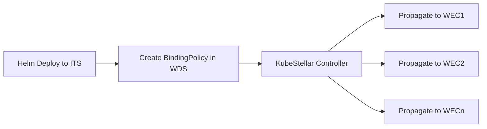

# 🚢 Helm Chart Deployment with KubeStellar Integration

## 📋 Overview

The A2A agent provides comprehensive Helm chart deployment capabilities with native KubeStellar binding policy integration. This allows you to deploy applications across multiple Kubernetes clusters while automatically setting up the necessary KubeStellar configurations for multi-cluster workload distribution.

## 🎯 What Makes This Special

Unlike traditional Helm deployments, the A2A Helm function:

- **🏷️ Auto-Labels Resources**: Automatically applies KubeStellar-compatible labels to all deployed resources
- **📋 Creates Binding Policies**: Automatically generates KubeStellar BindingPolicy manifests for workload distribution
- **🌐 Multi-Cluster Native**: Deploy to multiple clusters simultaneously with different configurations
- **🔄 Cluster-Specific Config**: Apply different values and settings per target cluster
- **🎯 Namespace Management**: Automatically creates and labels namespaces with KubeStellar metadata

## ⚠️ IMPORTANT: KubeStellar Deployment Flow

When using KubeStellar for multi-cluster deployments, you MUST follow this pattern:

1. **Deploy to ITS cluster ONLY** (e.g., `its1`) - This creates the workload template
2. **Create BindingPolicy in WDS** (e.g., `wds1`) - This defines distribution rules
3. **KubeStellar propagates to WECs** - Based on cluster labels matching the selector

❌ **NEVER deploy directly to WEC clusters** (cluster1, cluster2) when using KubeStellar
✅ **ALWAYS deploy to ITS** and let BindingPolicy handle propagation

## 🚀 Quick Start

### Complete Working Example

Here's the CORRECT way to deploy with KubeStellar:

```bash
# Step 1: Check available cluster labels
uv run python -m src.a2a.cli execute get_cluster_labels -P output_format=json

# Step 2: Deploy NGINX to ITS cluster ONLY with BindingPolicy
uv run python -m src.a2a.cli execute helm_deploy \
    -P operation=install \
    -P chart_name=nginx \
    -P repository_url=https://charts.bitnami.com/bitnami \
    -P release_name=webapp-demo \
    -P target_clusters='["its1"]' \
    -P namespace=production \
    -P set_values='["replicaCount=2"]' \
    -P wait=false \
    -P create_binding_policy=true \
    -P wds_context=wds1 \
    -P cluster_selector_labels='{"location-group": "edge"}'
```

This command:
- Deploys NGINX to ITS cluster (its1) ONLY - creates the template
- Creates namespace "production" if it doesn't exist
- Sets 2 replicas for the deployment
- Creates a BindingPolicy in the WDS cluster (wds1)
- BindingPolicy selects clusters with label `location-group=edge`
- KubeStellar automatically propagates to matching WECs (cluster1, cluster2)
- Uses `wait=false` to avoid timeout issues

### Verify the deployment:
```bash
# Check ITS deployment (template)
kubectl get all -n production --context its1

# Check BindingPolicy
kubectl get bindingpolicy webapp-demo-helm-policy --context wds1 -o yaml

# Check propagation to WECs
kubectl get all -n production --context cluster1
kubectl get all -n production --context cluster2
```

### 1. KubeStellar Multi-Cluster Deployment

Deploy a web application that propagates to multiple clusters:

```bash
# CORRECT: Deploy to ITS and use BindingPolicy for distribution
uv run python -m src.a2a.cli execute helm_deploy \
    -P operation=install \
    -P chart_name=nginx \
    -P repository_url=https://charts.bitnami.com/bitnami \
    -P release_name=webapp \
    -P target_clusters='["its1"]' \
    -P namespace=web-apps \
    -P set_values='["replicaCount=3"]' \
    -P wait=false \
    -P create_binding_policy=true \
    -P wds_context=wds1 \
    -P cluster_selector_labels='{"region": "production"}'
```

**What this does:**
- Installs NGINX Helm chart on ITS cluster (its1) as template
- Creates `web-apps` namespace with KubeStellar labels
- Creates a BindingPolicy in WDS (wds1)
- KubeStellar propagates to all clusters with label `region=production`
- All WECs get the same configuration (3 replicas)

### 2. Direct Multi-Cluster Deployment (Non-KubeStellar)

If you need to deploy directly to clusters WITHOUT KubeStellar:

```bash
# Deploy directly to multiple clusters (no BindingPolicy)
uv run python -m src.a2a.cli execute helm_deploy \
    -P operation=install \
    -P chart_name=nginx \
    -P repository_url=https://charts.bitnami.com/bitnami \
    -P release_name=webapp \
    -P target_clusters='["cluster1", "cluster2"]' \
    -P cluster_set_values='["cluster1=replicaCount=3", "cluster2=replicaCount=5"]' \
    -P namespace=web-apps \
    -P create_binding_policy=false \
    -P wait=false
```

### 3. Database Deployment with KubeStellar

Deploy Redis with persistence using KubeStellar:

```bash
# Deploy Redis to ITS with BindingPolicy
uv run python -m src.a2a.cli execute helm_deploy \
    -P operation=install \
    -P chart_name=redis \
    -P repository_url=https://charts.bitnami.com/bitnami \
    -P release_name=cache \
    -P target_clusters='["its1"]' \
    -P set_values='["persistence.enabled=true", "persistence.size=10Gi"]' \
    -P namespace=database \
    -P wait=false \
    -P create_binding_policy=true \
    -P wds_context=wds1 \
    -P cluster_selector_labels='{"tier": "database"}' \
    -P kubestellar_labels='{"app": "redis", "env": "production"}'
```

**Note**: With KubeStellar, all WECs get the same configuration. For cluster-specific storage classes, you would need to use different BindingPolicies or deploy directly without KubeStellar.

## 📖 Detailed Usage Guide

### Core Parameters

#### Required Parameters
- `chart_name`: Name of the Helm chart (e.g., `nginx`, `redis`)
- `repository_url`: Chart repository URL (e.g., `https://charts.bitnami.com/bitnami`)
- `release_name`: Name for the Helm release (e.g., `my-app`)

#### Targeting Parameters
- `target_clusters`: List of cluster names to deploy to
- `namespace`: Target namespace (default: `default`)
- `all_namespaces`: Deploy to all namespaces (boolean)

#### Configuration Parameters
- `set_values`: List of global Helm values (e.g., `["replicaCount=3", "image.tag=v2.0"]`)
- `cluster_set_values`: Cluster-specific values (e.g., `["cluster1=replicas=2", "cluster2=replicas=4"]`)
- `values_file`: Path to values file
- `cluster_values`: Cluster-specific values files (e.g., `["cluster1=values-prod.yaml"]`)

#### KubeStellar Integration
- `create_binding_policy`: Create BindingPolicy (default: `true`)
- `binding_policy_name`: Custom policy name (default: auto-generated)
- `cluster_selector_labels`: Labels for cluster selection in BindingPolicy
- `kubestellar_labels`: Additional labels for resources
- `wds_context`: WDS cluster context for BindingPolicy creation

### Operations Supported

#### 1. Install (Default)
```bash
uv run python -m src.a2a.cli execute helm_deploy \
    -P operation=install \
    -P chart_name=nginx \
    -P repository_url=https://charts.bitnami.com/bitnami \
    -P release_name=web-server \
    -P target_clusters='["cluster1"]'
```

#### 2. Upgrade
```bash
uv run python -m src.a2a.cli execute helm_deploy \
    -P operation=upgrade \
    -P chart_name=nginx \
    -P repository_url=https://charts.bitnami.com/bitnami \
    -P release_name=web-server \
    -P target_clusters='["cluster1"]' \
    -P set_values='["image.tag=v2.0", "replicaCount=5"]'
```

#### 3. Status Check
```bash
uv run python -m src.a2a.cli execute helm_deploy \
    -P operation=status \
    -P release_name=web-server \
    -P target_clusters='["cluster1"]' \
    -P namespace=default
```

#### 4. History
```bash
uv run python -m src.a2a.cli execute helm_deploy \
    -P operation=history \
    -P release_name=web-server \
    -P target_clusters='["cluster1"]' \
    -P namespace=default
```

#### 5. Uninstall
```bash
uv run python -m src.a2a.cli execute helm_deploy \
    -P operation=uninstall \
    -P release_name=web-server \
    -P target_clusters='["cluster1"]' \
    -P namespace=default
```

## 🏗️ Real-World Scenarios

### Scenario 1: Microservices Application

Deploy a complete microservices stack across multiple environments:

```bash
# Frontend service
uv run python -m src.a2a.cli execute helm_deploy \
    -P chart_name=nginx \
    -P repository_url=https://charts.bitnami.com/bitnami \
    -P release_name=frontend \
    -P target_clusters='["staging", "production"]' \
    -P cluster_set_values='["staging=replicaCount=2", "production=replicaCount=5"]' \
    -P namespace=frontend \
    -P kubestellar_labels='{"app": "ecommerce", "tier": "frontend"}'

# Backend API
uv run python -m src.a2a.cli execute helm_deploy \
    -P chart_name=nodejs \
    -P repository_url=https://charts.bitnami.com/bitnami \
    -P release_name=api \
    -P target_clusters='["staging", "production"]' \
    -P cluster_set_values='["staging=resources.requests.memory=512Mi", "production=resources.requests.memory=1Gi"]' \
    -P namespace=backend \
    -P kubestellar_labels='{"app": "ecommerce", "tier": "backend"}'
```

### Scenario 2: Edge Computing Deployment

Deploy applications to edge clusters with location-specific configurations:

```bash
# Deploy monitoring to edge locations
uv run python -m src.a2a.cli execute helm_deploy \
    -P chart_name=prometheus \
    -P repository_url=https://prometheus-community.github.io/helm-charts \
    -P release_name=monitoring \
    -P target_clusters='["edge-us-west", "edge-us-east", "edge-eu-west"]' \
    -P cluster_set_values='["edge-us-west=retention=7d", "edge-us-east=retention=7d", "edge-eu-west=retention=14d"]' \
    -P namespace=monitoring \
    -P cluster_selector_labels='{"location-type": "edge"}' \
    -P kubestellar_labels='{"component": "monitoring", "deployment": "edge"}'
```

### Scenario 3: Blue-Green Deployment

Implement blue-green deployment pattern:

```bash
# Deploy to blue environment
uv run python -m src.a2a.cli execute helm_deploy \
    -P chart_name=nginx \
    -P repository_url=https://charts.bitnami.com/bitnami \
    -P release_name=app-blue \
    -P target_clusters='["production"]' \
    -P namespace=blue \
    -P set_values='["image.tag=v2.0", "service.annotations.traffic=0"]' \
    -P kubestellar_labels='{"deployment": "blue", "version": "v2.0"}'

# Deploy to green environment
uv run python -m src.a2a.cli execute helm_deploy \
    -P chart_name=nginx \
    -P repository_url=https://charts.bitnami.com/bitnami \
    -P release_name=app-green \
    -P target_clusters='["production"]' \
    -P namespace=green \
    -P set_values='["image.tag=v2.1", "service.annotations.traffic=100"]' \
    -P kubestellar_labels='{"deployment": "green", "version": "v2.1"}'
```

## 🎯 KubeStellar Integration Deep Dive

### KubeStellar Best Practices

1. **Always deploy to ITS cluster** (e.g., its1) when using BindingPolicy
2. **Never deploy to WEC clusters directly** when using KubeStellar
3. **Use get_cluster_labels** to discover available cluster labels
4. **Specify wds_context** for BindingPolicy creation
5. **Use cluster_selector_labels** to target specific WECs

### Understanding the Flow



### Automatic Resource Labeling

Every resource deployed gets these labels automatically:
```yaml
labels:
  app.kubernetes.io/managed-by: "Helm"
  app.kubernetes.io/instance: "my-release"
  app.kubernetes.io/name: "nginx"
  kubestellar.io/helm-chart: "nginx"
  kubestellar.io/helm-release: "my-release"
  # Plus any custom labels you specify
```

### BindingPolicy Generation

When `create_binding_policy=true`, the function creates:

```yaml
apiVersion: control.kubestellar.io/v1alpha1
kind: BindingPolicy
metadata:
  name: my-app-helm-policy
  labels:
    kubestellar.io/helm-chart: "nginx"
    kubestellar.io/helm-release: "my-app"
spec:
  clusterSelectors:
    - matchLabels:
        region: "production"  # From cluster_selector_labels
  downsync:
    - objectSelectors:
        - matchLabels:
            app.kubernetes.io/managed-by: "Helm"
            app.kubernetes.io/instance: "my-app"
```

### Namespace Management

Namespaces are automatically:
- Created if they don't exist
- Labeled with KubeStellar metadata
- Tagged with your custom labels

## 🔧 Advanced Configuration

### Using Values Files

```bash
# Create cluster-specific values files
echo "replicaCount: 3" > values-prod.yaml
echo "replicaCount: 1" > values-dev.yaml

# Deploy with values files
uv run python -m src.a2a.cli execute helm_deploy \
    -P chart_name=nginx \
    -P repository_url=https://charts.bitnami.com/bitnami \
    -P release_name=webapp \
    -P target_clusters='["production", "development"]' \
    -P cluster_values='["production=values-prod.yaml", "development=values-dev.yaml"]'
```

### Custom Repository Configuration

```bash
# Add custom repository
helm repo add myrepo https://my-custom-charts.example.com

# Deploy from custom repository
uv run python -m src.a2a.cli execute helm_deploy \
    -P chart_name=my-custom-app \
    -P repository_name=myrepo \
    -P release_name=custom-app \
    -P target_clusters='["cluster1"]'
```

### Dry Run for Testing

```bash
# Test deployment without making changes
uv run python -m src.a2a.cli execute helm_deploy \
    -P chart_name=nginx \
    -P repository_url=https://charts.bitnami.com/bitnami \
    -P release_name=test-app \
    -P target_clusters='["cluster1"]' \
    -P dry_run=true
```

## 🐛 Troubleshooting

### Common Issues

#### 1. Cluster Connection Issues
```bash
# Check cluster connectivity
kubectl config get-contexts
kubectl cluster-info --context=your-cluster
```

#### 2. Chart Repository Issues
```bash
# Update Helm repositories
helm repo update
helm search repo nginx
```

#### 3. Permission Issues
```bash
# Check RBAC permissions
kubectl auth can-i create deployments --namespace=target-namespace
kubectl auth can-i create bindingpolicies
```

#### 4. Deployment Stuck or Timeout Issues
If deployments appear to hang or timeout:
```bash
# Use wait=false to avoid waiting for resources
uv run python -m src.a2a.cli execute helm_deploy \
    -P operation=install \
    -P chart_name=nginx \
    -P repository_url=https://charts.bitnami.com/bitnami \
    -P release_name=myapp \
    -P target_clusters='["cluster1"]' \
    -P wait=false
```

#### 5. BindingPolicy Not Created
Ensure you specify the WDS context when creating binding policies:
```bash
# Specify wds_context for KubeStellar integration
uv run python -m src.a2a.cli execute helm_deploy \
    -P operation=install \
    -P chart_name=nginx \
    -P repository_url=https://charts.bitnami.com/bitnami \
    -P release_name=myapp \
    -P target_clusters='["its1", "cluster1"]' \
    -P create_binding_policy=true \
    -P wds_context=wds1 \
    -P cluster_selector_labels='{"location-group": "edge"}'
```

### Debug Mode

Enable verbose output for troubleshooting:
```bash
# Add debug information
uv run python -m src.a2a.cli execute helm_deploy \
    -P chart_name=nginx \
    -P repository_url=https://charts.bitnami.com/bitnami \
    -P release_name=debug-app \
    -P target_clusters='["cluster1"]' \
    -P dry_run=true  # Shows what would be executed
```

## 🔗 Related Resources

- [KubeStellar Documentation](https://docs.kubestellar.io/)
- [Helm Documentation](https://helm.sh/docs/)
- [Kubernetes Multi-Cluster Guide](https://kubernetes.io/docs/concepts/cluster-administration/cluster-administration-overview/)
- [A2A Function Development Guide](./adding_functions.md)

## 💡 Tips and Best Practices

1. **Start with Dry Run**: Always test with `dry_run=true` first
2. **Use Meaningful Names**: Choose descriptive release names and namespaces
3. **Cluster-Specific Config**: Leverage cluster-specific values for environment differences
4. **Monitor Deployments**: Use status and history operations to track deployments
5. **Label Consistently**: Use consistent labeling strategy across your deployments
6. **Backup Before Upgrade**: Always check current state before upgrading
7. **Clean Up**: Regularly review and remove unused deployments